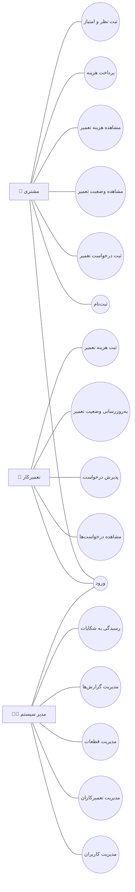

# Use Case Diagram

## پروژه
سامانه هوشمند اتصال تعمیرکار موبایل به مشتری

```mermaid
flowchart LR

Customer["👤 مشتری"]
Technician["🔧 تعمیرکار"]
Admin["👨‍💼 مدیر سیستم"]

UC1((ثبت‌نام))
UC2((ورود))
UC3((ثبت درخواست تعمیر))
UC4((مشاهده وضعیت تعمیر))
UC5((مشاهده هزینه تعمیر))
UC6((پرداخت هزینه))
UC7((ثبت نظر و امتیاز))

UC8((مشاهده درخواست‌ها))
UC9((پذیرش درخواست))
UC10((به‌روزرسانی وضعیت تعمیر))
UC11((ثبت هزینه تعمیر))

UC12((مدیریت کاربران))
UC13((مدیریت تعمیرکاران))
UC14((مدیریت قطعات))
UC15((مدیریت گزارش‌ها))
UC16((رسیدگی به شکایات))

Customer --- UC1
Customer --- UC2
Customer --- UC3
Customer --- UC4
Customer --- UC5
Customer --- UC6
Customer --- UC7

Technician --- UC2
Technician --- UC8
Technician --- UC9
Technician --- UC10
Technician --- UC11

Admin --- UC2
Admin --- UC12
Admin --- UC13
Admin --- UC14
Admin --- UC15
Admin --- UC16
```